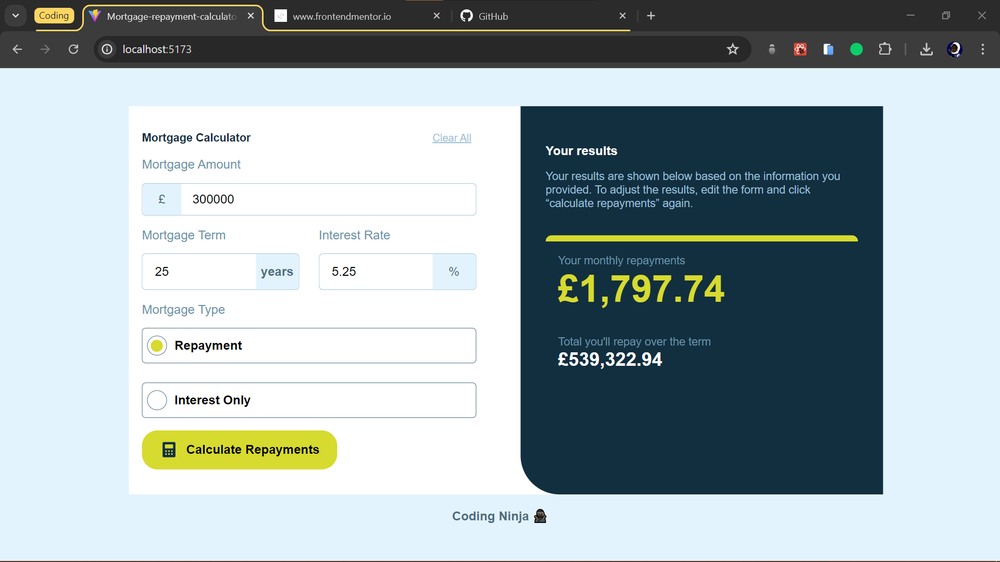

# Frontend Mentor - Mortgage repayment calculator solution

This is a solution to the [Mortgage repayment calculator challenge on Frontend Mentor](https://www.frontendmentor.io/challenges/mortgage-repayment-calculator-Galx1LXK73). Frontend Mentor challenges help you improve your coding skills by building realistic projects.

## Table of contents

- [Overview](#overview)
  - [The challenge](#the-challenge)
  - [Screenshot](#screenshot)
  - [Links](#links)
- [My process](#my-process)
  - [Built with](#built-with)
  - [What I learned](#what-i-learned)
  - [Continued development](#continued-development)
  - [Useful resources](#useful-resources)
- [Author](#author)
- [Acknowledgments](#acknowledgments)

## Overview

### The challenge

Users should be able to:

- Input mortgage information and see monthly repayment and total repayment amounts after submitting the form
- See form validation messages if any field is incomplete
- Complete the form only using their keyboard
- View the optimal layout for the interface depending on their device's screen size
- See hover and focus states for all interactive elements on the page

### Screenshot



### Links

- Solution URL: [Github](https://github.com/oluwatobicode/Mortgage-Calculator)
- Live Site URL: [Live Site](https://your-live-site-url.com)

## My process

### Built with

- Semantic HTML5 markup
- CSS custom properties
- Flexbox
- CSS Grid
- Desktop-first workflow
- [React](https://reactjs.org/) - JS library

### What I learned

I learnt how to useContext + useReducer for form validations and setting search Inputs.

```js
/* eslint-disable react/prop-types */
import { useContext, createContext, useReducer } from "react";

// initial state for the object

const initialState = {
  amount: "",
  interest: "",
  term: "",
  error: "",
  selected: null,
  type: "",
  result: null,
  total: null,
};

// dispatch function
function reducer(state, action) {
  switch (action.type) {
    case "mortgageAmount":
      return { ...state, amount: action.payLoad };
    case "mortgageTerm":
      return { ...state, term: action.payLoad };
    case "mortgageInterest":
      return { ...state, interest: action.payLoad };
    case "mortgageType":
      return { ...state, type: action.payLoad, selected: action.chosen };
    case "noInput":
      return { ...state, error: action.payLoad };
    case "calculate":
      return {
        ...state,
        error: action.payLoad,
        result:
          state.type === "Repayment"
            ? (parseInt(state.amount) *
                (parseFloat(state.interest) / 100 / 12)) /
              (1 -
                (1 + parseFloat(state.interest / 100) / 12) **
                  -(12 * parseFloat(state.term)))
            : parseInt(state.amount) * (parseFloat(state.interest) / 100 / 12),
        total:
          state.type === "Repayment"
            ? parseFloat(state.result) * (12 * parseInt(state.term))
            : parseFloat(state.result) * (12 * parseInt(state.term)) +
              parseInt(state.amount),
      };

    case "clear":
      return {
        amount: "",
        interest: "",
        term: "",
        error: "",
        type: null,
        result: null,
        total: null,
      };
    default:
      throw new Error("action not recognized!");
  }
}

// 1. Create the context
const mortgage = createContext();

const MortgageProvider = ({ children }) => {
  const [
    { type, term, amount, interest, selected, result, total, error },
    dispatch,
  ] = useReducer(reducer, initialState);

  return (
    <div>
      <mortgage.Provider
        value={{
          type,
          dispatch,
          amount,
          term,
          interest,
          selected,
          result,
          total,
          error,
        }}
      >
        {children}
      </mortgage.Provider>
    </div>
  );
};

// 2. Consume the context
const useMort = () => {
  const context = useContext(mortgage);
  if (context === undefined)
    throw new Error("It was used outside of the context provider!");
  return context;
};

// 3. Export the contextApi so it can be used everywhere

export { MortgageProvider, useMort };
```

```jsx
<div className="section-two-input-one">
  <h3>Mortgage Amount</h3>
  <div className="mortgage-amount-input">
    <div className={`${error ? "error-icon-pounds" : "pounds-icon"}`}>£</div>
    <input
      value={amount}
      onChange={(e) =>
        dispatch({ type: "mortgageAmount", payLoad: e.target.value })
      }
      className={`amount-input ${error ? "error-input" : ""}`}
      type="text"
      name=""
      id=""
    />
  </div>
  {error && <p className="error">{error}</p>}
</div>
```

### Useful resources

- [w3schools](https://www.w3schools.com/jsref/jsref_parsefloat.asp) - This helped me understand converting strings to numbers in javascript.
- [Shaodow Box generator](https://cssgenerator.org/box-shadow-css-generator.html) - This is an amazing site that helped me with generating css box shadows.

## Author

- Website - [Treasure](https://linktr.ee/codingninja)
- Frontend Mentor - [@oluwatobicode](https://www.frontendmentor.io/profile/oluwatobicode)
- Twitter - [@oluwatobicodes](https://www.twitter.com/oluwatobicodes)
